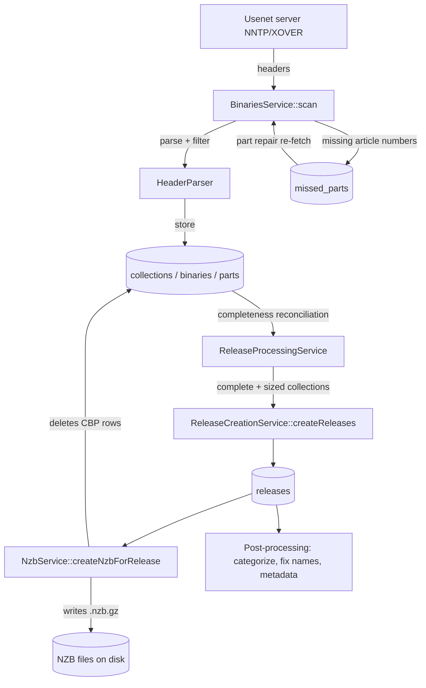
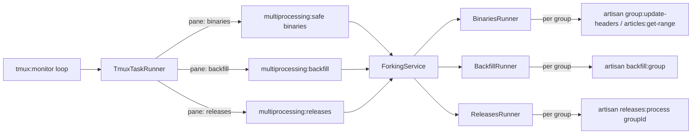

# The Indexing Pipeline: From Usenet Headers to NZB Files

This document traces the core flow of NNTmux: how the tmux-managed scripts
download Usenet article headers, how those headers are grouped into binaries
and collections, how complete collections become **releases**, and how a
`.nzb` file is finally written to disk.

It is intended as the first piece of the architecture documentation. Paths
below are relative to the repository root.

## Glossary

| Term | Meaning |
| --- | --- |
| **Article / header** | A single Usenet post. The indexer only downloads headers (subject, poster, message-id, byte count) via NNTP `XOVER`, never article bodies. |
| **Part** | One article that carries a piece of a file. Subjects look like `Some.Release "file.r01" yEnc (03/45)` — this article is part 3 of 45 of `file.r01`. Stored in the `parts` table. |
| **Binary** | One file, i.e. the set of parts that share a subject (minus the part counter). `file.r01` with its 45 parts is one row in `binaries`. |
| **Collection** | One multi-file post: all binaries that belong together (the rars, par2s, nfo of one upload). Grouped by a normalized subject. Stored in `collections`. |
| **Release** | A finished, searchable item created from a complete collection. Stored in `releases`. |
| **NZB** | Gzipped XML file listing every group/segment (message-id) needed to download the release. Written to disk; after that the collection/binary/part rows are deleted. |

The database hierarchy during ingestion is:

```
collections (1) ──< binaries (N) ──< parts (N)
```

This "CBP" data is *staging data*. Once a release's NZB is written, the CBP
rows are deleted — the NZB file itself becomes the durable record of the
segments.

## High-level flow



## 1. Orchestration: the tmux layer

Everything is driven by long-running artisan commands inside a tmux session.

| Piece | File | Role |
| --- | --- | --- |
| `php artisan tmux:start` | `app/Console/Commands/TmuxStart.php` | Creates the tmux session, builds windows/panes via `TmuxLayoutBuilder`, then launches the monitor script in pane 0.0. |
| Monitor script | `app/Services/Tmux/Scripts/monitor.php` | Thin wrapper that execs `php artisan tmux:monitor`. |
| `php artisan tmux:monitor` | `app/Console/Commands/TmuxMonitor.php` | The heartbeat. An infinite loop (default 10 s tick) that collects stats (`TmuxMonitorService`), redraws the monitor pane (`TmuxOutput`), and (re)spawns work in the other panes via `TmuxTaskRunner`. |
| `TmuxTaskRunner` | `app/Services/Tmux/TmuxTaskRunner.php` | Builds the shell command for each pane (with `nice`, logging via `tee`, and a `showsleep.php` delay) and respawns the pane with it. |
| `TmuxPaneManager` / `TmuxSessionManager` | `app/Services/Tmux/` | Low-level wrappers around the `tmux` CLI (`new-window`, `split-window`, `respawn-pane`, …). Panes are tagged with a role via the `@nntmux_role` pane option. |

### Window / pane layout (non-sequential mode)

Built by `TmuxLayoutBuilder` (`app/Services/Tmux/TmuxLayoutBuilder.php`):

- **Window 0**: Monitor, Binaries, Backfill, Releases
- **Window 1**: Fix names, Remove crap
- **Window 2**: Post-processing (additional, TV/anime, movies, metadata)
- **Window 3**: IRC scraper (predb)
- **Windows 4+**: optional monitoring tools (htop, mytop, redis, …)

### What each pane actually runs

Each monitor tick, `TmuxTaskRunner` respawns idle panes with one of these
commands (each pane's setting must be enabled, and "work available" counts
are checked first):

| Pane role | Command | Purpose |
| --- | --- | --- |
| Binaries | `php artisan multiprocessing:safe binaries` | Download new headers for all active groups. |
| Backfill | `php artisan multiprocessing:backfill` | Fetch *older* headers, walking backwards from each group's `first_record`. |
| Releases | `php artisan multiprocessing:releases` | Turn complete collections into releases + NZBs. |
| Fix names | `php artisan releases:fix-names <level> --update …` (levels 3–19) | Rename badly-named releases using NFOs, file lists, par2, predb, etc. |
| Remove crap | `php artisan releases:remove-crap …` | Delete spam/junk releases. |
| Post additional / TV / movies / metadata | `php artisan multiprocessing:postprocess add\|nfo\|tv\|mov\|ama` | Download samples/NFOs, match to TMDB/TVDB/IGDB/etc. |
| IRC scraper | `php artisan irc:scrape` | Populate the `predb` table from scene pre channels. |

The `multiprocessing:*` commands all delegate to `ForkingService`
(`app/Services/ForkingService.php`), which dispatches to a runner in
`app/Services/Runners/`. Runners fan work out across worker processes
(one artisan child process per newsgroup / work unit, capped by the
`binarythreads` / `releasethreads` settings), using Laravel Processes or the
`Concurrency` facade.



`BinariesRunner::safeBinaries()` (`app/Services/Runners/BinariesRunner.php`)
is worth noting: it compares each group's local `last_record` against the
server's newest article number (from the `short_groups` stats table) and
splits large gaps into bounded `articles:get-range` chunks of `maxmssgs`
headers each, so many ranges of one group can be fetched in parallel. Small
gaps get a single `group:update-headers` worker.

## 2. Stage one: headers → collections / binaries / parts

Entry points `update:binaries`, `group:update-headers`, and
`articles:get-range` all end up in **`BinariesService`**
(`app/Services/Binaries/BinariesService.php`).

Per group, `updateGroup()`:

1. Selects the group on the NNTP server (`NNTPService`).
2. Runs **part repair** first (see below) if enabled.
3. Computes the wanted article range: from the group's stored `last_record`
   forward to the server's newest article (capped by `maxmssgs` per batch and
   `max_headers_iteration` per run). New groups start `backfill_target` days
   back.
4. Calls `scan()` for each batch.

`scan()` does the actual ingestion:

1. **Download** headers for the range via NNTP `XOVER` (optionally
   compressed).
2. **Parse & filter** each header with `HeaderParser`
   (`app/Services/Binaries/HeaderParser.php`):
   - The subject must match `^(.+?) \((\d+)/(\d+)\)` — i.e. *"name (part/total)"*.
     Anything else is counted as "not yEnc" and dropped. This regex is how a
     *binary part* is identified; `matches[1]` is the binary's name,
     `matches[2]/matches[3]` are the part number and total parts.
   - Headers matching the group's **black/white lists** (`BlacklistService`,
     `binaryblacklist` table) are dropped.
3. **Store** the surviving headers with `HeaderStorageService`
   (`app/Services/Binaries/HeaderStorageService.php`), in chunks, inside a
   transaction (`HeaderStorageTransaction`):
   - **Collection**: `CollectionHandler` asks `CollectionsCleaningService`
     to normalize the subject into a collection name — first trying the
     group-specific regexes in the `collection_regexes` table, then generic
     cleaning. The identity of a collection is
     `sha1(cleanedName . totalFilesInPost)` stored as `collections.collectionhash`
     — every part of every file of the same upload hashes to the same
     collection and is attached to it (`getOrCreateCollections`, bulk
     insert-or-lookup by hash). Cross-posted groups from the `Xref:` header
     are recorded in `collection_groups`.
   - **Binary**: `BinaryHandler` computes an identity hash
     (`md5(subject + poster)`, lower-cased) so all parts of one file map to
     one `binaries` row (name, `totalparts`, `filenumber`, `collections_id`).
   - **Part**: `PartHandler` buffers and bulk-inserts one `parts` row per
     header: `binaries_id`, article `number`, `messageid`, `partnumber`,
     `size`. The message-id is what later goes into the NZB `<segment>`.
4. **Track failures**: any article number that was requested but not received
   or not inserted is recorded in the `missed_parts` table
   (`MissedPartHandler`).

### Part repair — finding the missing pieces

Usenet propagation is imperfect, so parts are often missing on the first
pass. Before fetching new headers, `BinariesService::partRepair()` re-requests
the article numbers listed in `missed_parts` (in ranges), and `scan(type:
'partrepair')` inserts whichever now arrive and removes them from the table.
Each miss increments an attempt counter; after `partrepairmaxtries` the row
is given up and purged. This loop is how "all of the parts of a binary are
found" over successive runs.

## 3. Stage two: collections → releases

`multiprocessing:releases` fans out one `releases:process <groupId>` worker
per group that has collections (`ReleasesRunner`). That command
(`app/Console/Commands/ProcessReleasesCommand.php`) drives
**`ReleaseProcessingService`** (`app/Services/ReleaseProcessingService.php`)
through a fixed sequence. The state machine lives in
`collections.filecheck` (`app/Enums/CollectionFileCheckStatus.php`):

| filecheck | Enum case | Meaning |
| --- | --- | --- |
| 0 | `Default` | Still accumulating parts. |
| 1 | `CompleteCollection` | All files present (intermediate). |
| 2 | `CompleteParts` | All files *and* all parts of each file present — ready to size. |
| 3 | `Sized` | `filesize` computed; ready to become a release. |
| 4 | `Inserted` | Release row created; awaiting NZB. |
| 5 | `Delete` | Marked for deletion. |
| 15 / 16 | `TempComplete` / `ZeroPart` | Edge cases for stale/zero-part handling. |

The per-group sequence:

1. **`processIncompleteCollections()`** — reconciles counts from the ground
   up: parts are the authority for each binary's `currentparts`/`partsize`
   (`partcheck = 1` when `currentparts >= totalparts`), and binaries are the
   authority for the collection's `filesize` and completeness. A collection
   is promoted to `filecheck = 2` when every expected file is present and
   complete. Collections older than the `delaytime` setting (hours) are
   *force-completed* with whatever files they have — this is the "stop
   waiting for parts that will never arrive" valve.
2. **`processCollectionSizes()`** — promotes `2 → 3` (sizes were already
   aggregated in step 1).
3. **`deleteUnwantedCollections()`** — drops sized collections that fail
   group/site limits (min/max size, min files) or consist only of `.par2`
   files.
4. **`createReleases()`** → **`ReleaseCreationService`**
   (`app/Services/ReleaseCreationService.php`). For each `filecheck = 3`
   collection:
   - Clean the subject into a human search name
     (`ReleaseCleaningService::releaseCleaner`, `release_naming_regexes`).
   - Try to match a scene **predb** title (`Predb::matchPre`).
   - **Duplicate check** (`ReleaseDuplicateFinder`) — duplicate collections
     are deleted instead of inserted.
   - **Categorize** (`CategorizationService::determineCategory`) from the
     name/group/poster.
   - Insert the `releases` row (new GUID, `nzbstatus = 0`), link the
     collection (`filecheck = 4`, `releases_id`), and record cross-post
     groups in `releases_groups`.
5. **`createNZBs()`** — see next section. Steps 4–5 loop while a full batch
   (`maxnzbsprocessed`) keeps coming back.
6. **`deleteCollections()`** — final cleanup of stale/orphaned CBP rows.

When run for all groups (no `groupId`), the command finishes with
release-level cleanup: `deletedReleasesByGroup()`, `deleteReleases()`
(removes releases violating retention/size/completion rules), and
`categorizeReleases()`.

## 4. Stage three: writing the NZB

`ReleaseProcessingService::createNZBs()` claims releases with
`nzbstatus = 0` (claim tokens + bounded retry attempts, see
`NzbCreationCandidateQuery`) and calls
**`NzbService::createNzbForRelease()`** (`app/Services/Nzb/NzbService.php`):

1. Load the release's collections; verify no collection is empty and no
   binary has zero parts (deterministic failures → the release is deleted
   after max attempts; transient failures are retried).
2. Stream-write gzipped XML with `XMLWriter` to a **temp file**:
   - `<head>` metadata (category, name);
   - one `<file poster date subject>` element per binary, with the
     collection's cross-post `<groups>`;
   - one `<segment bytes number>message-id</segment>` per part, paged out of
     the `parts` table in keyset-ordered chunks.
3. Atomically move the temp file into place at
   `{nzbpath}/{split-dirs}/{guid}.nzb.gz`, where the directory fan-out comes
   from the first hex chars of the release GUID (`nzbsplitlevel` setting).
4. Mark the release `nzbstatus = 1` (`NZB_ADDED`).
5. **Delete the collections/binaries/parts** for the release
   (`CollectionCleanupService`) — the staging data has served its purpose.

From this point the release is live: it is searchable (Manticore/Elastic
indexes are populated from `releases`), appears in the web UI and API, and
the API serves the stored `.nzb.gz` when a user grabs it. Post-processing
panes continue to enrich it (proper names, movie/TV/game/music metadata,
NFOs, previews) asynchronously.

## The three regex tables

Three database tables hold admin-editable regexes (managed under
Admin → Regexes, all served by `app/Services/RegexService.php`). For a given
newsgroup, `RegexService` loads every enabled row whose `group_regex` matches
the group name (`status = 1`, ordered by `ordinal`, cached ~15 minutes) and
tries them in order — first match wins.

| Table | Consumed by | Stage | Effect |
| --- | --- | --- | --- |
| `collection_regexes` | `CollectionsCleaningService::collectionsCleaner()` | Header ingestion | The regex's **named capture groups** are concatenated into the collection's canonical name, which (plus file count) is hashed into `collections.collectionhash`. These regexes define collection identity: too loose merges unrelated posts, too strict splinters one upload into collections that never complete. Falls back to generic hard-coded cleaning when nothing matches. |
| `release_naming_regexes` | `ReleaseCleaningService::releaseCleaner()` | Release creation | Named captures build the human-facing `searchname` and set `properlynamed`. This name feeds the predb match and categorization. |
| `category_regexes` | Admin UI only | — | **Dormant at runtime in this fork.** `RegexService` still supports it (a match would return the row's `categories_id`), but the only code constructing `RegexService('category_regexes')` is the admin CRUD controller. Live categorization uses the `CategorizationPipeline` with hard-coded PHP regexes; the legacy `Blacklight\Categorize` consumer no longer exists. |

Traceability: when a release is created, the matched collection regex id and
naming regex id are recorded in the `release_regexes` table, so any release
can be traced back to the regexes that shaped it.

Named capture group caveat: for `collection_regexes` and
`release_naming_regexes`, only *named* capture groups contribute to the
output string (groups named `reqid` or `parts` are ignored), and the captures
are concatenated in alphabetical key order — regex authors control ordering
by naming groups e.g. `(?<name1>…)`, `(?<name2>…)`.

## Timing / cadence summary

- The monitor tick is ~10 s; each pane's command ends with a visible sleep
  (`bins_timer`, `rel_timer`, `back_timer`, `post_timer`, … settings) before
  the monitor respawns it, so each pipeline stage runs on its own cadence.
- Binaries and releases stages are decoupled by the database: header
  ingestion only writes CBP rows; release processing only reads them. They
  can (and do) run concurrently for different groups.
- `delaytime` (default 2 h) is the deliberate lag between "first part seen"
  and "give up waiting for stragglers", trading completeness against
  latency.

## Key files quick reference

| Concern | File |
| --- | --- |
| Session/pane orchestration | `app/Console/Commands/TmuxStart.php`, `app/Console/Commands/TmuxMonitor.php`, `app/Services/Tmux/` |
| Pane commands | `app/Services/Tmux/TmuxTaskRunner.php` |
| Process fan-out | `app/Services/ForkingService.php`, `app/Services/Runners/` |
| Header download & ingestion | `app/Services/Binaries/BinariesService.php` |
| Subject parsing / filtering | `app/Services/Binaries/HeaderParser.php`, `app/Services/BlacklistService.php` |
| Collection identity | `app/Services/Binaries/CollectionHandler.php`, `app/Services/CollectionsCleaningService.php` |
| Binary/part storage | `app/Services/Binaries/BinaryHandler.php`, `app/Services/Binaries/PartHandler.php` |
| Part repair | `app/Services/Binaries/MissedPartHandler.php` |
| Release pipeline | `app/Services/ReleaseProcessingService.php`, `app/Console/Commands/ProcessReleasesCommand.php` |
| Release creation | `app/Services/ReleaseCreationService.php` |
| NZB writing | `app/Services/Nzb/NzbService.php` |
| Collection state machine | `app/Enums/CollectionFileCheckStatus.php` |
